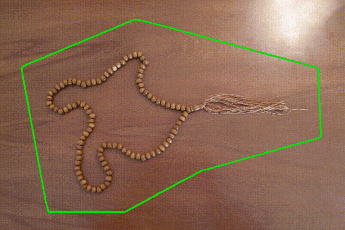

# Image Processing Projects

## Morphing

    

    <a href='/src/Morphing.ipynb'>Link</a>

## Poisson Blending

    

    <a href='/src/Poisson_Blending.ipynb'>Link</a>

## Multiresolution Blending and Feathering

    

    <a href='/src/Multiresolution_Blending_and_Feathering.ipynb'>Link</a>

## Active Contours

    

    <a href='/src/Active_Contours.ipynb'>Link</a>

## Texture Synthesis

    

    <a href='/src/Texture_Synthesis.ipynb'>Link</a>

- [Sharpening](/src/Sharpening.ipynb)
- [Template Matching](/src/Template_Matching.ipynb)
- [Hybrid Images](/src/Hybrid_Images.ipynb)
